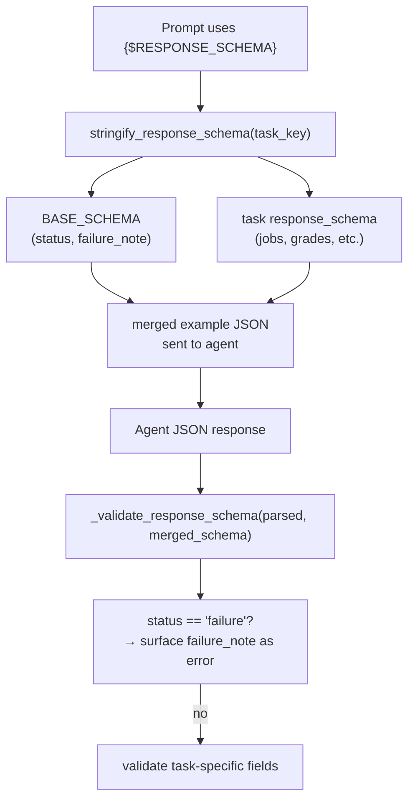

---

name: Response Schema Envelope
overview: Introduce a BASE_SCHEMA envelope that wraps every task's response_schema, so that status/failure_note (and any future universal fields) are automatically included in every agent call's prompt and validation — without touching individual schemas.
todos:

- id: base-schema
content: Add BASE_SCHEMA constant above TASK_CONFIG in config.py
status: completed
- id: stringify
content: Update stringify_response_schema to merge BASE_SCHEMA before rendering the example JSON
status: completed
- id: validate
content: Update _validate_response_schema in anthropic.py to merge BASE_SCHEMA and short-circuit on status=failure
status: completed

---

# Response Schema Envelope

## The Pattern

Every agent response becomes a two-layer structure:

```
{
  "status": "success | failure",
  "failure_note": "<reason if failure>",
  ... task-specific fields ...
}
```

`{$RESPONSE_SCHEMA}` in prompts renders the full merged shape. Validation checks the envelope first, then the task fields.

## Flow




## Changes

### 1. `[src/utils/config.py](src/utils/config.py)`

Add `BASE_SCHEMA` above `TASK_CONFIG`:

```python
BASE_SCHEMA = {
    "status": {"type": "str", "required": True, "enum": ["success", "failure"]},
    "failure_note": {"type": "str", "required": False},
}
```

Update `stringify_response_schema` to merge `BASE_SCHEMA` into the example before rendering:

```python
def stringify_response_schema(task_key: str) -> str:
    schema = TASK_CONFIG.get(task_key, {}).get("response_schema")
    if not schema:
        return ""
    merged = {**BASE_SCHEMA, **schema}   # envelope fields first, task fields after
    return json.dumps(_schema_to_example(merged), indent=2)
```

### 2. `[src/external/anthropic.py](src/external/anthropic.py)`

Update `_validate_response_schema` to merge `BASE_SCHEMA` before validating, and short-circuit on `status == "failure"`:

```python
from src.utils.config import BASE_SCHEMA

def _validate_response_schema(parsed, schema, task_key):
    if not parsed or not isinstance(parsed, dict):
        return "Parsed response is empty or not a dict"
    merged_schema = {**BASE_SCHEMA, **schema}
    # Envelope check first
    if parsed.get("status") == "failure":
        note = parsed.get("failure_note") or "Agent returned status=failure with no note"
        return f"Agent failure: {note}"
    # Then validate full merged schema
    for field_name, field_spec in merged_schema.items():
        ...  # existing logic unchanged
```

## What this gets us

- `{$RESPONSE_SCHEMA}` in any prompt now always shows `status` and `failure_note` first — agents see the contract
- Validation rejects `{"jobs": []}` type silent failures — they must return `status: "failure"` with a note
- Adding a new universal field in future = one line in `BASE_SCHEMA`, zero other changes
- No individual `response_schema` entries need to change

