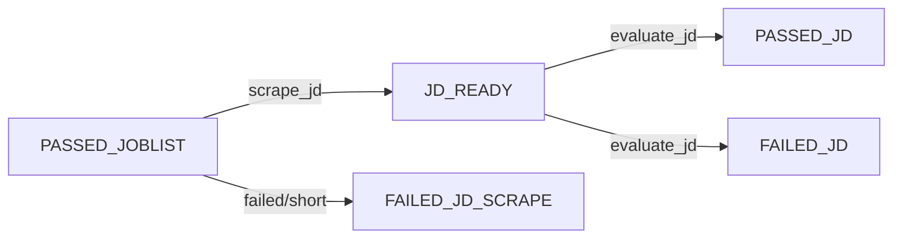

<!-- linear-archive: AST-326 archived 2026-06-03 -->

## Linear archive (AST-326)

**Archived:** 2026-06-03  
**Linear URL:** https://linear.app/astralcareermatch/issue/AST-326/batch-scrape-jds  
**Status at archive:** Done  
**Project:** Astral Gazer  
**Assignee:** susan  
**Priority / estimate:** None / —  
**Parent:** —  
**Blocked by / blocks / related:** —

### Description

—

### Comments

_No comments._

---

# AST-326: Batch Scrape JDs

Add `scrape_jd` task (PASSED_JOBLIST → JD_READY), batch `evaluate_jd` via `_run_batch_consult` helper, and clean up the coat-check and dispatcher.

## New State Flow



## Changes

### 1. [`src/utils/config.py`](src/utils/config.py)

- Add `JD_READY` and `FAILED_JD_SCRAPE` to `JOB_STATES` with `batch_criteria`
- Add transitions `(PASSED_JOBLIST, JD_READY)` and `(PASSED_JOBLIST, FAILED_JD_SCRAPE)` to `TRACKER_CONFIG["job_state_transitions"]`
- Add `JD_READY` to `IN_REVIEW_STATES` (between `PASSED_JOBLIST` and `PASSED_JD`)
- Add `FAILED_JD_SCRAPE` to `SKIPPED_STATES`
- Add `scrape_jd` to `DISPATCH_TASKS`: `{"entity_type": "job", "trigger_state": "PASSED_JOBLIST"}`
- Add `scrape_jd` block to `CONSULT_CONFIG` — no `batch_size`:
  ```python
  "scrape_jd": {
      "input_state": "PASSED_JOBLIST",
      "pass_state": "JD_READY",
      "fail_state": "FAILED_JD_SCRAPE",
  }
  ```
- Remove `playwright_session_limit` from `ASTRAL_CONFIG` entirely
- Change `evaluate_jd["input_state"]` from `"PASSED_JOBLIST"` to `"JD_READY"`
- Add `"input_state": "NEW"` to `qualify_job_listings` (fixing the hardcoded bug)
- Update `evaluate_jd` response schema from single-job `{"grades": [...]}` to batch `{"jobs": [{"astral_job_id": ..., "grades": [...]}, ...]}`

### 2. [`src/core/gazer.py`](src/core/gazer.py)

- Move `_prune_jd` here from `tracker.py`
- Add `scrape_jd_batch(batch_id, jobs, debug)`:
  - `asyncio.gather` over all jobs — batch size controls concurrency, no semaphore
  - `_prune_jd` + `jd_min_chars` gate per job
  - fail → transition to `FAILED_JD_SCRAPE`, pass → save to `job_data` + transition to `JD_READY`

### 3. [`src/core/consult.py`](src/core/consult.py)

Add `_run_batch_consult(task_key, batch_id, jobs, assemble_fn, process_fn, ctx, debug)`:

- `live_content = assemble_fn(jobs)` — caller-supplied
- Single `do_task(task_key, live_content, ...)` call
- Shared: ID reconciliation (missing/fabricated), audit entry, batch error transition on failure
- Per matched job: `to_state = process_fn(input_job, response_job, cfg)`
- Returns `{"success", "passed", "failed", "total", "missing", "fabricated", "bad_grades"}`

`qualify_job_listings` becomes a thin wrapper:

```python
async def qualify_job_listings(batch_id, jobs, ctx, debug):
    def assemble(jobs): return enumerate_array("JOB LISTINGS", [...raw_html...], ...)
    def process(input_job, response_job, cfg):
        tracker.initialize_job(...)
        tracker.save_job_data(..., {"joblist_grades": response_job["grades"]})
        return _render_pass_fail(...)
    return await _run_batch_consult("qualify_job_listings", batch_id, jobs, assemble, process, ctx, debug)
```

`evaluate_jd_batch` is the new thin wrapper for JD evaluation:

```python
async def evaluate_jd_batch(batch_id, jobs, ctx, debug):
    def assemble(jobs): return enumerate_array("JD LISTINGS", [...jd_text...], ...)
    def process(input_job, response_job, cfg):
        tracker.save_job_data(..., {"jd_grades": response_job["grades"]})
        return _render_pass_fail(...)
    return await _run_batch_consult("evaluate_jd", batch_id, jobs, assemble, process, ctx, debug)
```

### 4. [`src/core/dispatcher.py`](src/core/dispatcher.py)

- `_run_evaluate_jd` becomes Pattern A — calls `evaluate_jd_batch(bid, jobs, ...)` directly, no `_warm_then_gather`, no per-job loop, no Phase 1 prefetch block
- Add `_run_scrape_jd(ctx, limit, debug)`: reads from `CONSULT_CONFIG["scrape_jd"]`, calls `scrape_jd_batch`, register in `_RUNNERS`
- Fix `_run_qualify` hardcoded `"NEW"` → `task_cfg["input_state"]`

### 5. [`src/core/tracker.py`](src/core/tracker.py)

- Remove `_prune_jd` (moved to `gazer.py`)
- Keep coat-check self-heal in `get_job_data` but replace inline fetch+prune with `scrape_jd_batch(str(uuid.uuid4()), [job])` — single-job, same code path, no duplication
