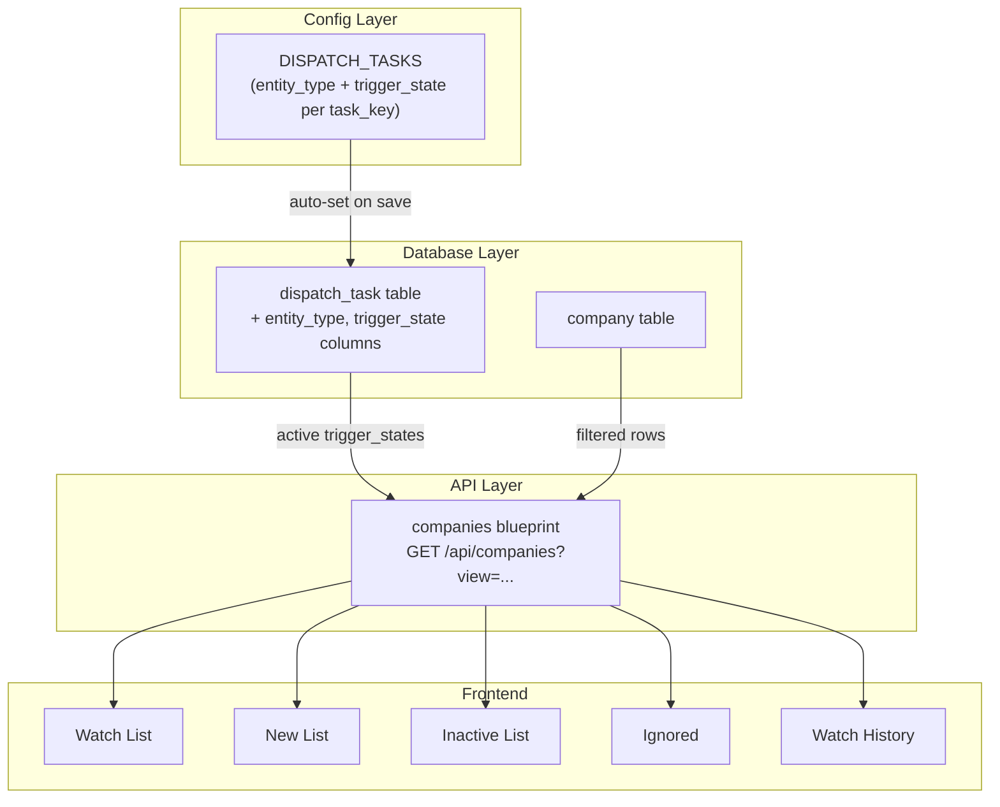

<!-- linear-archive: AST-207 archived 2026-06-03 -->

## Linear archive (AST-207)

**Archived:** 2026-06-03  
**Linear URL:** https://linear.app/astralcareermatch/issue/AST-207/companies-interfaces  
**Status at archive:** Done  
**Project:** Astral Interface  
**Assignee:** susan  
**Priority / estimate:** Medium / 8  
**Parent:** —  
**Blocked by / blocks / related:** —

### Description

Implement all Companies screens. These screens expose the company roster and Gazer pipeline state — primarily list-based views for monitoring and managing which companies Astral is watching.

**Screens:**

**Watch List:** List Page. Each row is a company in WATCH state. Columns: company name, short_name, website, state, last scanned. In-screen functionality: Seek (trigger a Gazer scan for selected companies) and Import list (bulk import companies from CSV or paste). Bulk actions: Set to Ignore, Retry Scrape. Row action: Modal with company detail and state history.

New List: List page with an import function.  This page shows companies that are not yet in watch state, excluding ignored and companies experiencing gazer issues. This page allows the user to import company data from a csv and set them to the appropriate state.  The user will upload the csv with short_name, name, website_url with the state that triggers the prefilter company job from dispatch.

**Gazer Issues:** List Page. Companies with technical errors (scrape failures, bot blocks, parse errors). Columns: company name, state, error type, last attempted. Row action: Modal showing error detail and state history. Bulk action: Retry.

**Ignored:** List Page. Companies in IGNORE state. Columns: company name, short_name, prefilter reason, ignored at. Row action: Modal. Bulk action: Move to Watch.

**Watch History:** List Page. Read-only audit view. All companies with state history visible. Columns: company name, current state, state_changed_at, created_at. Sortable by state and date. Row action: Modal showing full state_history JSON rendered as a readable timeline.

**Acceptance Criteria:**

* All four screens implemented using ListPage and Modal from Component Library
* Each screen fetches from appropriate Flask API endpoint filtered by state
* Seek and Import in-screen functionality stubbed on Watch List (full implementation in a future feature)
* Bulk actions wired where specified
* State history rendered as readable timeline in row-level Modal
* All screens reachable via Companies nav links

### Comments

_No comments._

---

# AST-207: Companies Interfaces — Plan

## Overview

Implement all five Companies screens (Watch List, New List, Inactive List, Ignored, Watch History) with supporting API, database functions, and config. Also enhances the dispatch_task table with entity_type and trigger_state columns so the Inactive List can dynamically derive uncovered states.

## Architecture

The Inactive List screen is driven by a DB query against the `dispatch_task` table rather than hardcoded state lists. A company is "inactive" if its state does not appear as a `trigger_state` of any enabled dispatch task for the selected candidate, and is not IGNORE.



---

## Phase 1: Dispatch Task Enhancement

### 1a. Fix DISPATCH_TASKS trigger_states in `src/utils/config.py`

Correct the company task trigger_states to match ROSTER_CONFIG input_states:

- `prefilter`: "NEW" --> "WEBSITE_FOUND"
- `locate_job_page`: "WATCH" --> "TO_WATCH"
- `parse_job_list`: "JOB_PAGE" --> "TO_PARSE"
- `gaze`: "WATCH" (already correct)

### 1b. Add columns to dispatch_task table in `src/data/database.py`

- Add `entity_type TEXT` and `trigger_state TEXT` columns to dispatch_task (idempotent migration in `_ensure_dispatch_task_schema`)
- Backfill existing rows from DISPATCH_TASKS config (lookup by task_key)
- Update `save_dispatch_task` to accept and store entity_type + trigger_state
- Add `entity_type` and `trigger_state` to `_DISPATCH_TASK_UPDATE_COLS`

### 1c. Auto-resolve in core + API layer

- `src/core/dispatch.py`: Update `save_dispatch_task` to auto-resolve entity_type and trigger_state from DISPATCH_TASKS config based on task_key
- `src/ui/api/admin_dispatch_tasks.py`: On create, let core resolve entity_type/trigger_state. Add a `/task_keys/<task_key>` endpoint (or augment the existing `/task_keys` endpoint) that returns `{entity_type, trigger_state}` per task_key so the frontend can display them
- On update: if task_key changes (it doesn't currently, but defensively), re-resolve entity_type/trigger_state

### 1d. Task Dispatcher UI read-only fields in `ScheduledActions.tsx`

- Add entity_type and trigger_state to the DispatchTask interface
- Show them as read-only display fields in the add/edit modal (populated from config when task_key changes)
- Add columns to the table: "Entity" and "State"

---

## Phase 2: Database — Company Listing

### Add `list_companies` to `src/data/database.py`

```python
def list_companies(
    states: Optional[List[str]] = None,
    exclude_states: Optional[List[str]] = None,
    candidate_id: Optional[str] = None,
) -> List[Dict[str, Any]]:
```

- Queries company table with optional state IN/NOT IN filters and candidate_id FK filter
- Parses JSON columns via `_parse_company_row`
- Returns list of dicts

### Add `get_active_trigger_states` to `src/data/database.py`

```python
def get_active_trigger_states(candidate_id: str, entity_type: str) -> List[str]:
```

- `SELECT DISTINCT trigger_state FROM dispatch_task WHERE enabled=1 AND entity_type=? AND candidate_id=?`
- Used by the companies API to compute the inactive list

### Add `list_company_job_scans` to `src/data/database.py`

```python
def list_company_job_scans(candidate_id: Optional[str] = None, limit: int = 500) -> List[Dict[str, Any]]:
```

- Queries `company_job_scan` joined with `company` (for company_name), filtered by candidate_id FK if provided
- Ordered by `scan_completed_at DESC`
- Returns list of dicts with: short_name, company_name, scan_completed_at, new, total_found, duplicates, status, failure_message, batch_id

---

## Phase 3: Config Updates

### NAV_CONFIG in `src/utils/config.py`

Add "New List" and rename "Gazer Issues" to "Inactive List":

```python
{
    "label": "Companies",
    "visible": "LIVE_PROMPTS",
    "items": [
        {"label": "Watch List", "path": "/companies/watch_list"},
        {"label": "New List", "path": "/companies/new_list"},
        {"label": "Inactive List", "path": "/companies/inactive_list"},
        {"label": "Ignored", "path": "/companies/ignored"},
        {"label": "Watch History", "path": "/companies/watch_history"},
    ],
},
```

### DATA_SHAPES for companies in `src/utils/config.py`

Add column definitions per view (watch_list, new_list, inactive_list, ignored, watch_history) so the frontend can fetch shape from `/api/shapes/companies`.

---

## Phase 4: Companies API

### Create `src/ui/api/companies.py` blueprint

Register in `src/ui/server.py`.

**Endpoints:**

- `GET /api/companies?view=<view>&candidate_id=<id>` — list companies for a view. View logic:
  - `watch_list`: states = ["WATCH"]
  - `new_list`: states = active trigger_states (from dispatch_task) minus WATCH and IGNORE
  - `inactive_list`: exclude_states = active trigger_states + ["IGNORE"]
  - `ignored`: states = ["IGNORE"]
  - `watch_history`: all companies (no state filter)
- `GET /api/companies/<short_name>` — single company detail (for modal)
- `POST /api/companies/bulk_state` — body: `{short_names: [...], to_state: "..."}`. For bulk actions (Set to Ignore, Move to Watch, Retry)
- `POST /api/companies/import` — CSV import. Body: `{rows: [{short_name, company_name, company_website}]}`. Creates companies in WEBSITE_FOUND state (ready for prefilter pipeline)
- `GET /api/companies/scan_history?candidate_id=<id>` — Gazer scan report from company_job_scan table. Used by Watch History page

---

## Phase 5: Frontend Pages

All five pages follow the established ListPage + Modal pattern from `ManageCandidates.tsx`. Each page fetches shape from `/api/shapes/companies` and data from `/api/companies?view=<view>`.

### Shared: State History Timeline component

Create a small `StateTimeline` component rendered inside the row-detail modal on all company pages. It takes the company's `state_history` JSON array and renders a readable vertical timeline (read-only):

```
WATCH — 2026-03-04 14:22
TO_PARSE — 2026-03-02 09:15
TO_WATCH — 2026-03-01 11:30
WEBSITE_FOUND — 2026-02-28 16:00
```

This is per-company state progression, NOT the gazer scan history.

### `WatchList.tsx`

- Columns: company_name, short_name, company_website, state, last_scan_at
- Bulk actions: Set to Ignore, Retry Scrape
- Row click: Modal with company detail + state timeline
- idField: "short_name"

### `NewList.tsx` (new file)

- Columns: company_name, short_name, company_website, state, created_at
- Actions button: "Import" opens a modal with textarea for CSV paste (short_name, company_name, company_website) + upload button
- Row click: Modal with company detail
- idField: "short_name"

### `InactiveList.tsx` (rename from GazerIssues.tsx)

- Columns: company_name, short_name, state, state_updated_at
- Bulk actions: Retry (moves to WEBSITE_FOUND to re-enter pipeline)
- Row click: Modal with company detail + state timeline
- idField: "short_name"

### `Ignored.tsx`

- Columns: company_name, short_name, prefilter_company_notes (ignore reason, from company_data), state_updated_at
- Bulk action: "Move to Watch" (sets state to TO_WATCH, for precious snowflakes)
- Row click: Modal with company detail + state timeline
- idField: "short_name"
- The API flattens `company_data.prefilter_company_notes` into a top-level field for column display

### `WatchHistory.tsx`

Gazer scan report — NOT per-company state history (that lives in the row-detail modal).

Data source: `company_job_scan` table, joined with company for display name.

- Columns: company_name, short_name, scan_completed_at (gazer timestamp), new (new jobs found), total_found, duplicates, status, batch_id
- Sorted by scan_completed_at DESC (most recent scans first)
- No bulk actions (read-only report)
- idField: composite or row index (batch_id + short_name is the PK)

Requires a new `list_company_job_scans` function in database.py and a corresponding API endpoint (`GET /api/companies/scan_history`).

---

## Phase 6: Nav Count Badges

### `/api/nav_config` enhancement in `src/ui/api/system.py`

When resolving the Companies group, compute counts for each view using the same logic as the companies API (list_companies with the same state filters). Include a `count` field on each nav item:

```python
{"label": "Watch List", "path": "/companies/watch_list", "enabled": True, "count": 47}
```

Only Companies items get counts (other groups return items without the field).

### NavigationShell badge rendering in `NavigationShell.tsx`

- Add optional `count?: number` to the `NavItem` interface
- When `count` is present, render it as a badge after the label: `Watch List [47]`
- Style: muted color, smaller font, inline with the label

---

## Phase 7: Routes + Cleanup

### `routes.tsx`

- Add `companies/new_list` route with NewList component
- Rename `companies/gazer_issues` to `companies/inactive_list` with InactiveList component
- Delete `GazerIssues.tsx` after rename

---

## Not changing

- Company state machine / transitions (no new states)
- Roster/Gazer/Tracker internals
- Batch processing logic
- Job dispatch trigger_states (verify separately if needed)
