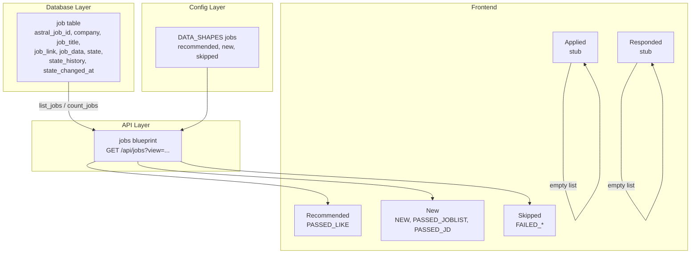

<!-- linear-archive: AST-208 archived 2026-06-03 -->

## Linear archive (AST-208)

**Archived:** 2026-06-03  
**Linear URL:** https://linear.app/astralcareermatch/issue/AST-208/jobs-interfaces  
**Status at archive:** Done  
**Project:** Astral Interface  
**Assignee:** susan  
**Priority / estimate:** Low / 8  
**Parent:** —  
**Blocked by / blocks / related:** —

### Description

Implement all five Jobs screens. These screens expose the job posting pipeline — sorted and filtered views of postings at each stage of the GET/DO/LIKE evaluation pipeline.

**Screens:**

**Meteors:** List Page. Jobs that have passed the full evaluation pipeline (PASSED_LIKE). The hot ones — candidate should act on these. Columns: job title, company, GET score, DO score, LIKE score, state_changed_at. Row action: Modal with full job detail, scores, and job description.

**New:** List Page. Jobs in NEW or early pipeline states (PASSED_JOBLIST, PASSED_JD) not yet fully evaluated. Columns: job title, company, state, created_at. Row action: Modal with available detail.

**Skipped:** List Page. Jobs that failed at any evaluation stage (FAILED_GET, FAILED_DO, FAILED_LIKE, FAILED_JD, FAILED_JOBLIST). Columns: job title, company, failed stage, reason summary. Row action: Modal showing evaluation detail and failure reason. Bulk action: Retry.

**Applied:** List Page. Jobs where candidate has submitted an application. Columns: job title, company, applied at, application notes. Row action: Modal to view/edit application notes and status.

**Responded:** List Page. Jobs where the company has responded (interview request, rejection, etc.). Columns: job title, company, response type, responded at, notes. Row action: Modal to view/edit response detail.

**Note:** Applied and Responded states are future Artifacts/Candidate workflow states — screens can be stubbed with empty lists until those pipeline stages are built.

**Acceptance Criteria:**

* All five screens implemented using ListPage and Modal from Component Library
* Meteors, New, and Skipped fetch from API filtered by their respective job states
* Applied and Responded screens implemented as stubs (empty list with correct layout) pending Artifacts pipeline
* Score display on Meteors formatted clearly (e.g. percentage or letter grade)
* Failure reason surfaced on Skipped where available in job_data
* All screens reachable via Jobs nav links

### Comments

_No comments._

---

# AST-208: Jobs Interfaces — Plan

## Overview

Implement all five Jobs screens (Recommended, New, Skipped, Applied, Responded) following the exact pattern established by the Companies screens in AST-207. This requires a new jobs API blueprint, `list_jobs`/`count_jobs` database functions, DATA_SHAPES for jobs, and five React pages.

## Architecture

Mirrors Companies exactly. Same stack: `database.py` → `src/ui/api/jobs.py` → `DATA_SHAPES["jobs"]` → React pages.



---

## Phase 1: Database — `list_jobs` and `count_jobs`

Add to [`src/data/database.py`](src/data/database.py), modeled directly on `list_companies` / `count_companies`:

```python
def list_jobs(
    states: Optional[List[str]] = None,
    candidate_id: Optional[str] = None,
    order_by: str = "state_changed_at",
) -> List[Dict[str, Any]]:
    # WHERE state IN (...) AND company IN (SELECT short_name FROM company WHERE candidate_id=?)
    # ORDER BY {order_by} DESC
    # Returns _job_row_to_dict per row (parses job_data, state_history)
```

```python
def count_jobs(
    states: Optional[List[str]] = None,
    candidate_id: Optional[str] = None,
) -> int:
    # SELECT COUNT(*) version — no full row fetch
```

`candidate_id` scopes via subquery on the `company` table (same pattern as `claim_job_batch`).

---

## Phase 2: Config — `DATA_SHAPES["jobs"]` + NAV_CONFIG

Add to [`src/utils/config.py`](src/utils/config.py) inside `DATA_SHAPES`:

- `list.recommended`: job_title, company, get_score, do_score, like_score, state_changed_at
- `list.new`: job_title, company, state, created_at
- `list.skipped`: job_title, company, failed_stage, fail_reason_summary, state_changed_at

Scores are stored in `job_data` as `get_score`, `do_score`, `like_score` (0.0–1.0 floats from `_render_score`). The API flattens these to top-level fields for column display.

`failed_stage` and `fail_reason_summary` are derived fields — the API flattens them.

NAV_CONFIG Jobs items ordered: New, Skipped, Meteors (`"enabled": False`), Recommended, Applied (`"enabled": False`), Responded (`"enabled": False`).

---

## Phase 3: API — `src/ui/api/jobs.py`

Create [`src/ui/api/jobs.py`](src/ui/api/jobs.py) with a `jobs_bp` blueprint at `/api/jobs`.

**Endpoints:**

- `GET /api/jobs?view=<view>&candidate_id=<id>` — list jobs per view:
  - `recommended`: states=`["PASSED_LIKE"]`, order by `state_changed_at`
  - `new`: states=`["NEW", "PASSED_JOBLIST", "PASSED_JD"]`, order by `created_at`
  - `skipped`: states=`["FAILED_GET", "FAILED_DO", "FAILED_LIKE", "FAILED_JD", "FAILED_JOBLIST"]`, order by `state_changed_at`
  - `applied` / `responded`: returns `[]` (stubs)
- `GET /api/jobs/<astral_job_id>` — single job detail (for modal)
- `POST /api/jobs/bulk_state` — body: `{astral_job_ids: [...], to_state: "..."}`. Used by Skipped retry.

**Flattening helpers** (applied before serving):

- `_flatten_recommended`: lifts `job_data.get_score`, `do_score`, `like_score` to top-level
- `_flatten_skipped`: derives `failed_stage` from job `state`, lifts first F-grade `reason` from the relevant grades array in `job_data` as `fail_reason_summary`

Register in [`src/ui/server.py`](src/ui/server.py).

---

## Phase 4: Nav Counts for Jobs

Add `_get_job_counts` to [`src/ui/api/system.py`](src/ui/api/system.py) (same pattern as `_get_company_counts`), merged into a unified `nav_counts` dict in `_resolve_nav`.

States counted:

- `/jobs/recommended`: `PASSED_LIKE`
- `/jobs/new`: `NEW` + `PASSED_JOBLIST` + `PASSED_JD`
- `/jobs/skipped`: all `FAILED_*` states

---

## Phase 5: Frontend Pages

All five are in [`src/ui/frontend/src/pages/Jobs/`](src/ui/frontend/src/pages/Jobs/). Pattern: same structure as `WatchList.tsx` / `Ignored.tsx`.

[`routes.tsx`](src/ui/frontend/src/routes.tsx): `Meteors.tsx` renamed to `Recommended.tsx`; `jobs/meteors` aliased to `Recommended` component for backward compatibility; default redirects point at `/jobs/recommended`.

**Recommended.tsx** — fetches `view=recommended`, shows get/do/like scores as percentages in modal. Columns from `shapes.list.recommended`. Modal: job_title, company, scores, job_link, job_description from `job_data` if present.

**New.tsx** — fetches `view=new`, columns from `shapes.list.new`. Modal: title, company, state, link.

**Skipped.tsx** — fetches `view=skipped`, columns from `shapes.list.skipped`. Bulk action: Retry (sets state to `NEW`). Modal: failed_stage, fail_reason_summary, full grades rendered inline.

**Applied.tsx** — stub: empty `ListPage`, pending Artifacts pipeline.

**Responded.tsx** — stub: empty `ListPage`, pending Artifacts pipeline.

---

## Files Changed

- [`src/data/database.py`](src/data/database.py) — add `list_jobs`, `count_jobs`
- [`src/utils/config.py`](src/utils/config.py) — add `DATA_SHAPES["jobs"]`; NAV_CONFIG Jobs reordered + disabled items
- [`src/ui/api/jobs.py`](src/ui/api/jobs.py) — new blueprint (created)
- [`src/ui/server.py`](src/ui/server.py) — register `jobs_bp`
- [`src/ui/api/system.py`](src/ui/api/system.py) — add `_get_job_counts`, wire into `_resolve_nav`
- [`src/ui/frontend/src/routes.tsx`](src/ui/frontend/src/routes.tsx) — rename import, alias `jobs/meteors`, redirects → `/jobs/recommended`
- [`src/ui/frontend/src/pages/Jobs/Recommended.tsx`](src/ui/frontend/src/pages/Jobs/Recommended.tsx) — implemented (renamed from Meteors.tsx)
- [`src/ui/frontend/src/pages/Jobs/New.tsx`](src/ui/frontend/src/pages/Jobs/New.tsx) — implemented
- [`src/ui/frontend/src/pages/Jobs/Skipped.tsx`](src/ui/frontend/src/pages/Jobs/Skipped.tsx) — implemented
- [`src/ui/frontend/src/pages/Jobs/Applied.tsx`](src/ui/frontend/src/pages/Jobs/Applied.tsx) — stub
- [`src/ui/frontend/src/pages/Jobs/Responded.tsx`](src/ui/frontend/src/pages/Jobs/Responded.tsx) — stub
